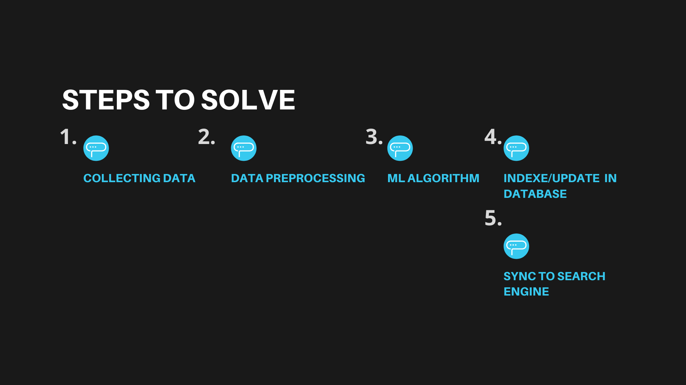
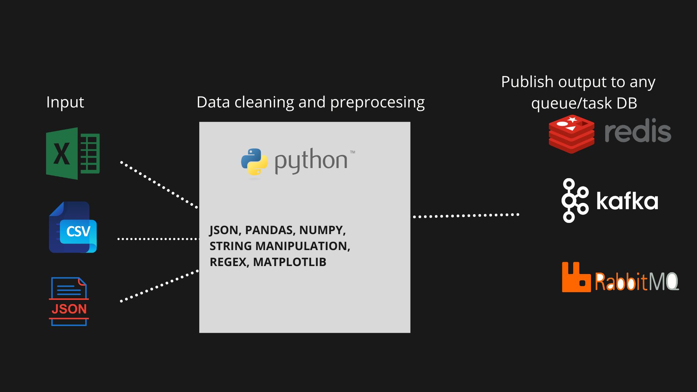
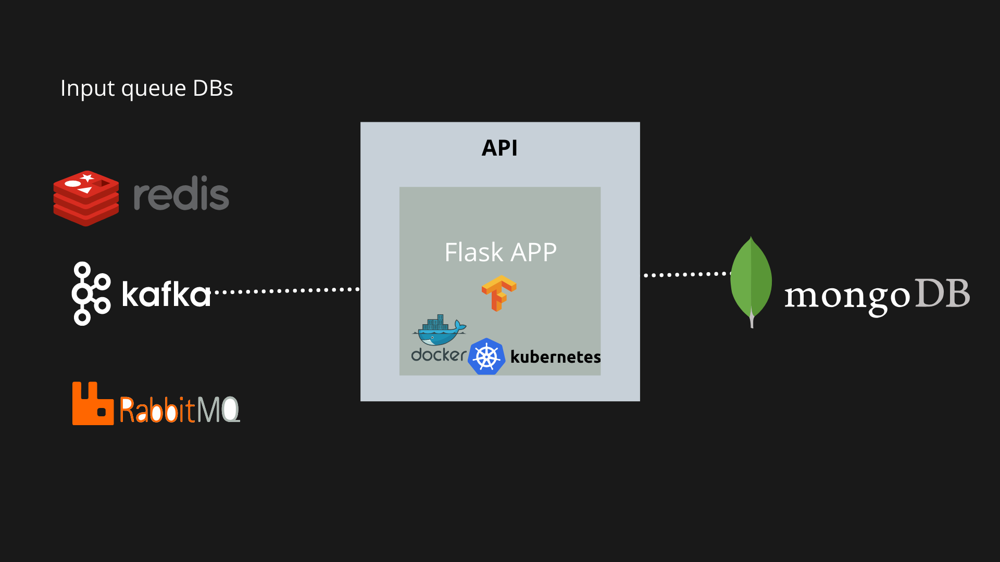

<details><summary>Model Summary</summary>
    <p>
      # Building a data pipeline for highly unstructured renewable energy data.



####  Collecting Data & Data Pre-Processing
This process includes collecting data and preprocessing them. Finally publish the data to any queue DB for next task.



 
* How you can read Data.
```python
import pandas as pd
solar_data = pd.read_excel("solar_data.xls") #incase excel data
```

<details><summary>Output:</summary>
    <p>
<div>
<style scoped>
    .dataframe tbody tr th:only-of-type {
        vertical-align: middle;
    }

    .dataframe tbody tr th {
        vertical-align: top;
    }

    .dataframe thead th {
        text-align: right;
    }
</style>
<table border="1" class="dataframe">
  <thead>
    <tr style="text-align: right;">
      <th></th>
      <th>What Do You Want To Do?</th>
      <th>What Kind of Renewable Energy are you loooking for?</th>
      <th>Qualifying Questions</th>
      <th>What are you looking to power?</th>
      <th>What kind of property is it?</th>
      <th>Qualifying Q</th>
      <th>Qualifying Questions.1</th>
      <th>Products</th>
      <th>Unnamed: 8</th>
      <th>Category 1</th>
      <th>...</th>
      <th>Minor category 1.4</th>
      <th>Category 2</th>
      <th>Subcategory 2</th>
      <th>Minor category 2</th>
      <th>Category 3</th>
      <th>Subcategory 3</th>
      <th>Minor category 3</th>
      <th>Category 4</th>
      <th>Subcategory 4</th>
      <th>Minor category 4</th>
    </tr>
  </thead>
  <tbody>
    <tr>
      <th>0</th>
      <td>Reivew Renewable Energy Options</td>
      <td>Solar Power for my….</td>
      <td>NaN</td>
      <td>Home</td>
      <td>On Grid</td>
      <td>profile questions - hold for next release</td>
      <td>NaN</td>
      <td>Resi Grid Tie Packages</td>
      <td>NaN</td>
      <td>Solar</td>
      <td>...</td>
      <td>NaN</td>
      <td>NaN</td>
      <td>NaN</td>
      <td>NaN</td>
      <td>NaN</td>
      <td>NaN</td>
      <td>NaN</td>
      <td>NaN</td>
      <td>NaN</td>
      <td>NaN</td>
    </tr>
    <tr>
      <th>1</th>
      <td>NaN</td>
      <td>NaN</td>
      <td>NaN</td>
      <td>NaN</td>
      <td>Off Grid</td>
      <td>profile questions - hold for next release</td>
      <td>NaN</td>
      <td>Resi Off Grid Packages</td>
      <td>NaN</td>
      <td>Solar</td>
      <td>...</td>
      <td>NaN</td>
      <td>NaN</td>
      <td>NaN</td>
      <td>NaN</td>
      <td>NaN</td>
      <td>NaN</td>
      <td>NaN</td>
      <td>NaN</td>
      <td>NaN</td>
      <td>NaN</td>
    </tr>
    <tr>
      <th>2</th>
      <td>NaN</td>
      <td>NaN</td>
      <td>NaN</td>
      <td>Small Business</td>
      <td>Own building/property</td>
      <td>NaN</td>
      <td>NaN</td>
      <td>Commercial Solar Pkgs</td>
      <td>NaN</td>
      <td>Engineering/Design</td>
      <td>...</td>
      <td>NaN</td>
      <td>NaN</td>
      <td>NaN</td>
      <td>NaN</td>
      <td>NaN</td>
      <td>NaN</td>
      <td>NaN</td>
      <td>NaN</td>
      <td>NaN</td>
      <td>NaN</td>
    </tr>
    <tr>
      <th>3</th>
      <td>NaN</td>
      <td>NaN</td>
      <td>NaN</td>
      <td>Guest/Pool House</td>
      <td>On Grid</td>
      <td>profile questions - hold for next release</td>
      <td>NaN</td>
      <td>Resi Grid Tie Packages</td>
      <td>NaN</td>
      <td>Solar</td>
      <td>...</td>
      <td>NaN</td>
      <td>NaN</td>
      <td>NaN</td>
      <td>NaN</td>
      <td>NaN</td>
      <td>NaN</td>
      <td>NaN</td>
      <td>NaN</td>
      <td>NaN</td>
      <td>NaN</td>
    </tr>
    <tr>
      <th>4</th>
      <td>NaN</td>
      <td>NaN</td>
      <td>NaN</td>
      <td>NaN</td>
      <td>Off Grid</td>
      <td>profile questions - hold for next release</td>
      <td>NaN</td>
      <td>Resi Off Grid Packages</td>
      <td>NaN</td>
      <td>Solar</td>
      <td>...</td>
      <td>NaN</td>
      <td>NaN</td>
      <td>NaN</td>
      <td>NaN</td>
      <td>NaN</td>
      <td>NaN</td>
      <td>NaN</td>
      <td>NaN</td>
      <td>NaN</td>
      <td>NaN</td>
    </tr>
  </tbody>
</table>
<p>5 rows × 24 columns</p>
</div>
</p>
</details>

```python
# Remove the NAN data. Other wise It will make problem incase of data insertion in DBs.
solar_data = solar_data.replace(np.nan, "")

# Apply text processing
solar_data = solar_data.apply(lambda i: process_text(i))

# For the data like *Engineering/Design* . We can separate values using separator and convert to array or dict.
#incase
text = "Engineering/Design"
# we can convert it to list
text = text.split("/")


# visualize and analysis the data by grouping/ aggregating.
solar_data.group_by("Category 1")
 ####
 
```

* After Pre-processing send the data to any QUEUE DB

Let's here I am taking KAFKA. Kafka has a topic and each topic has multiple subscribers and consumers. For a same service we can have multiple consumers inside consumer group for distributed workload.

Creating a topic.
```python
from kafka.admin import KafkaAdminClient, NewTopic

admin_client = KafkaAdminClient(bootstrap_servers=CONFIG.kafka_server)

topic_list = [NewTopic(name=<topic_name>, num_partitions=<no_of_partition>, replication_factor=<no_of_replica>)]
admin_client.create_topics(new_topics=topic_list, validate_only=False)
```

Publish to KAFKA.
```python
from time import sleep
from json import dumps
from kafka import KafkaProducer

producer = KafkaProducer(bootstrap_servers=[<kafka_server>],
                         value_serializer=lambda x:
                         dumps(x).encode('utf-8'))
data = {
       ----
    }

producer.send(<topic_name>, value=data)

```


#### Applying ML Algorithm
* We can mine the data for extracting keyword informations. 
    *  We can apply named entiti recognization model for identifying the attributes from text.
    e.g: If in data we have:
    "What Kind of Renewable Energy are you loooking for?"
    Ans: I am looking for **Home**
    
    The model will hellp to identify 
    
    **HOME** is actually the installation location.
    
    How can we do this?
    We have all the text. and the installation location name and we can train a NER model for this.
    
    REFERENCE: [https://arxiv.org/pdf/1909.10148v1.pdf](https://arxiv.org/pdf/1909.10148v1.pdf)
    
    
* There are multiple level classification.
As an example:
"What Kind of Renewable Energy are you looking for?" =  "solar in my home...."
"What are you looking to power?" = "home"
"What kind of property is it?" = "On Grid"
"Products" = "Resi Grid Tie Packages"


We can take these data and make an multilevel classification model which will predict an hierarchial classification tree.
e.g: classification_l1 = "Solar"
e.g: classification_l2 = "Solar Packages"

This can be in two Ways.

* Apply a sequence modeling
* Apply multiple softmax layer above extracted global feature for N level of classifications.


* I have good experience in working with keras and tensorflow.
Here I have attached oneof my repo [https://github.com/IIITian-Chandan/Product-Image-Grouping](https://github.com/IIITian-Chandan/Product-Image-Grouping)


I can use FLASK/ Falcon for making ML services as API. and deploy using container.

 
 
#### How to Save data in MONGODB.
I use pymongo in python.

```python
import pymongo
from pymongo import MongoClient

MONGODB_URI = <MONGO_URI>
MONGODB_DATABASE = <DB_NAME>
MONGODB_COLLECTION = <COLLECTION_NAME>

client = pymongo.MongoClient(
    MONGODB_URI,
    ssl=False
)
db = client[MONGODB_DATABASE][MONGODB_COLLECTION]
items = [{}, {}....] # list of objects
db.insert_many(items)

```


#### Sync the data to elasticsearch for querying.

You can use elasticsearch python client or node js library for moving data.

In elasticsearch you can do several filter and aggregation query for visualization.

For text matching
exact match: you can use **term, match (with boost 1)**
phrase matching: **match phrase**
wildcard matching: **wildcard**
for filtering: **filter**
We can use scripted filter and all
so on......


We can do several aggreggations like count, range, cardinality, histogram ...etc..

#### We can store the same data in NEO4J.

Where prodocts and classifications can be nodes and I can connect products with a relationship


```(:Products)-[:has]->(:Classification)```

We can write
```
CREATE (p:Products{"name":"", "setup_location":"",....}})
CREATE (c:Classification{"l1":"", "l2":"",....}})

CREATE (p)-[h:has]->(c)
RETURN p,h,c
```

We can do filtering and aggregation above this

